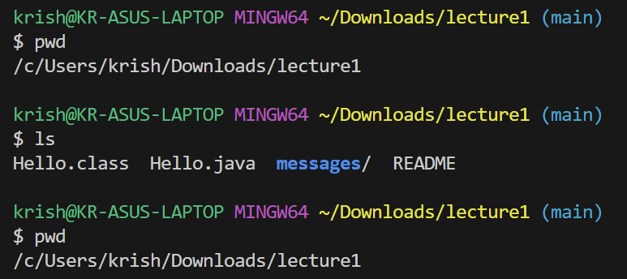
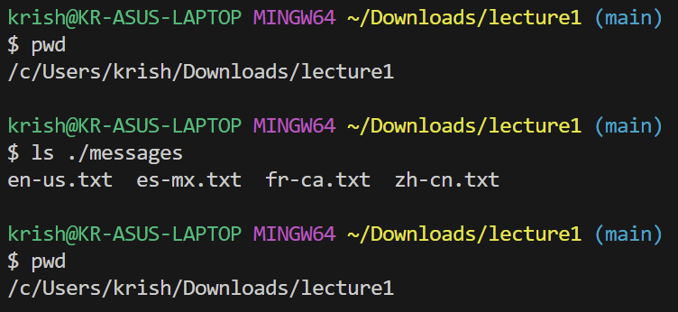
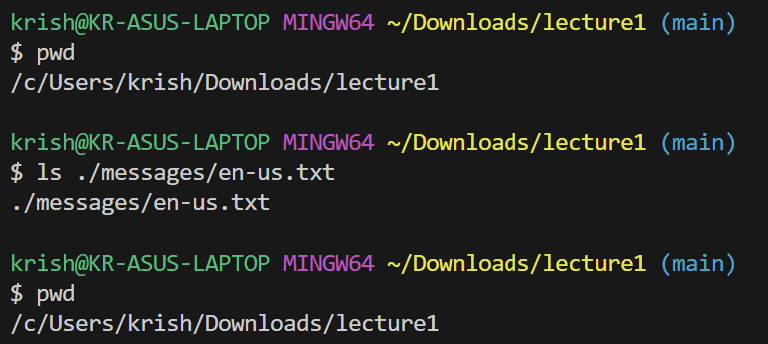
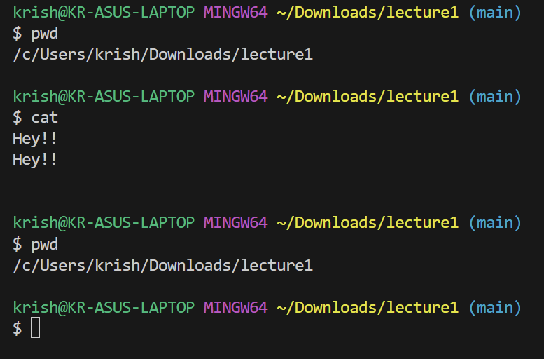
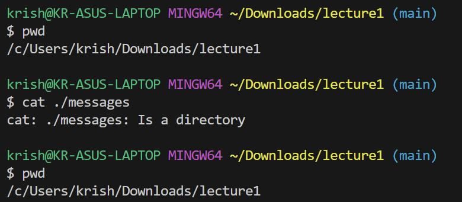
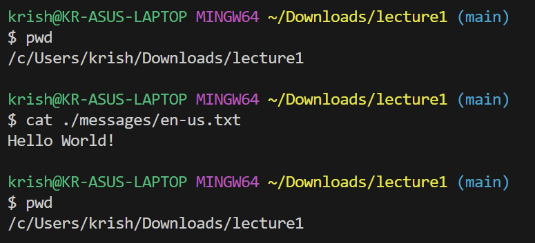

# Krishna Rastogi Lab Report 1

## `cd` Command

When using no argument with `cd`, it is as if I have just given the argument `./` which is just the relative path to the current directory. Hence, the directory will not change and behaves as expected.

Here, the argument given to the command was the relative path to the `Downloads` folder located in the working directory. The argument given was valid and the directory was changed correctly. 

The argument given was the relative path to a Java file, not a directory, so an error message is given stating that the argument was not a directory. This is only an error from the user but the terminal behaves as it should and responds correctly to the incorrect argument.

## `ls` Command

When using no argument with `ls`, it is as if I have just given the argument `./` which is just the relative path to the current directory. Hence, the contents of the current working directory were listed.

Here, the argument given to the command was the relative path to the `messages` directory located in the working directory. The argument given was valid and the contents of that directory were listed.

The argument given was the relative path to a text file, not a directory, so the argument that was given to the `ls` is just reprinted. This doesn't seem to be an error as nothing actually went wrong in the terminal and so it seems to be the intended response for this case.

## `cat` Command

When using no argument with `cat`, it hasn't been given a file to read from so it just reads from user input into the terminal. Here is just repeats the same phrase I enter.

Here, the argument given to the command was the relative path to the `messages` directory located in the working directory. Since it wasn't given a file or any input to read from, the terminal sends a message that the arguemnt given was a terminal and reponds correctly to the users unusual input.

The argument given was the relative path to a text file, not a directory, so the argument that was given to the `ls` is just reprinted. This doesn't seem to be an error as nothing actually went wrong in the terminal and so it seems to be the intended response for this case.
